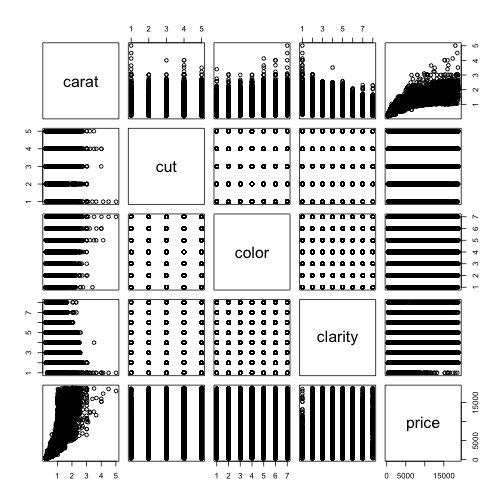

Diamon (app) Presentation
Week 4 - Course Project
========================================================
author: Dr. Chamika Senanayake
date: 06/10/2020
autosize: true

Introduction
========================================================
Have you ever considered how jewels are valued past the quantity of carats(or weight)? Cost additionally relies upon the precious stone's cut, shading, and clearness.

- Cut: quality of the diamond from best to worst (Ideal, Premium, Very Good, Good, Fair)
- Color: best(D) to worst(J)
- Clarity: measures how clear the diamond is from best to worst (IF, VVS2, VVS1, VS2, VS1, SI2, SI1, I1)

This shiny app will predict diamond price based on your input of these factors as we have used it in previous courses

Documentation
========================================================

summary of the "diamonds" dataset found in the ggplot2 R package. 


```
tibble [53,940 × 5] (S3: tbl_df/tbl/data.frame)
 $ carat  : num [1:53940] 0.23 0.21 0.23 0.29 0.31 0.24 0.24 0.26 0.22 0.23 ...
 $ cut    : Ord.factor w/ 5 levels "Fair"<"Good"<..: 5 4 2 4 2 3 3 3 1 3 ...
 $ color  : Ord.factor w/ 7 levels "D"<"E"<"F"<"G"<..: 2 2 2 6 7 7 6 5 2 5 ...
 $ clarity: Ord.factor w/ 8 levels "I1"<"SI2"<"SI1"<..: 2 3 5 4 2 6 7 3 4 5 ...
 $ price  : int [1:53940] 326 326 327 334 335 336 336 337 337 338 ...
```

ummary plot of the diamond data with each of the relevant variables plotted against each other
========================================================



Thank you! have a nice day!
========================================================

Links
- shiny app: https://chamikarproj.shinyapps.io/Data-products-dev-assignment/
- source code [githubrepo]: https://github.com/ChamikaRproj/Data-products-dev-assignment/tree/assignment2
